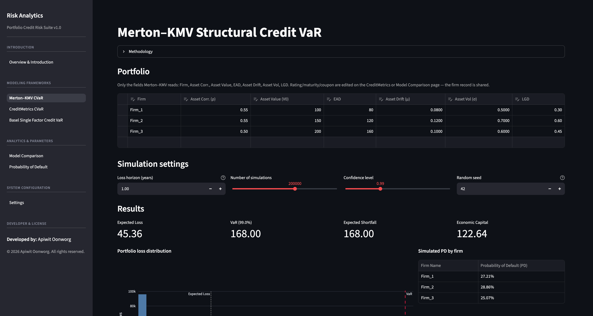
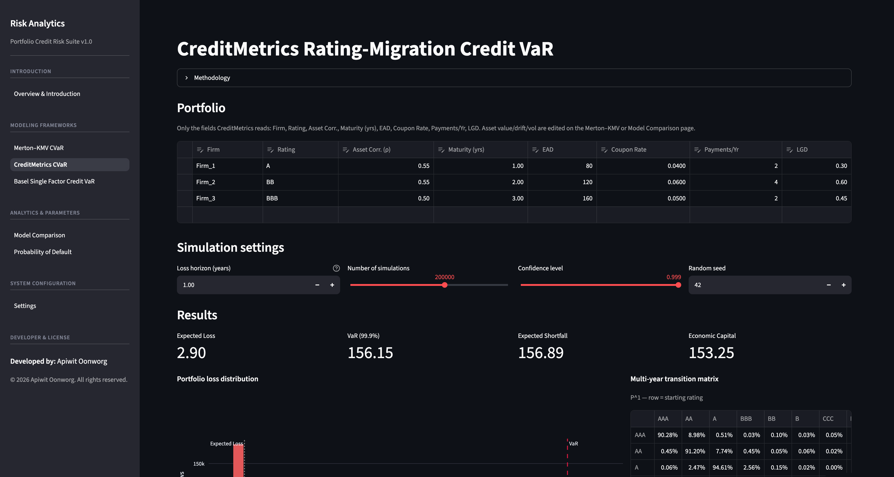
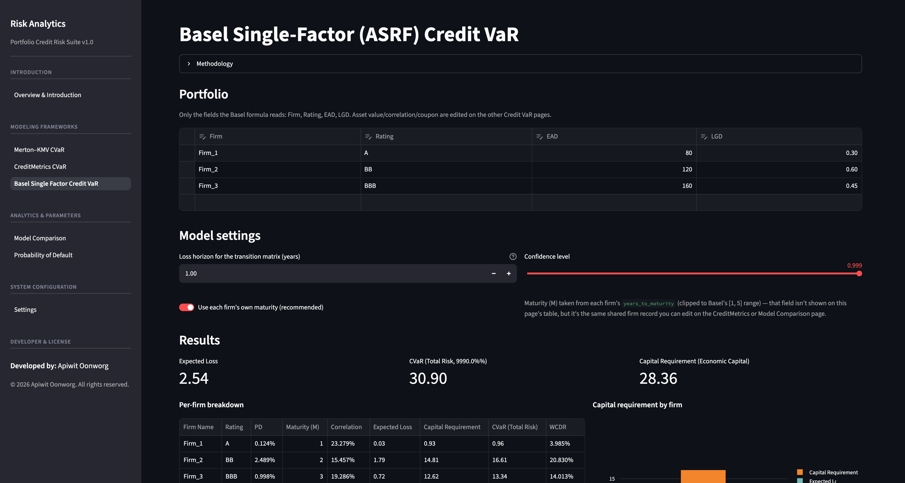
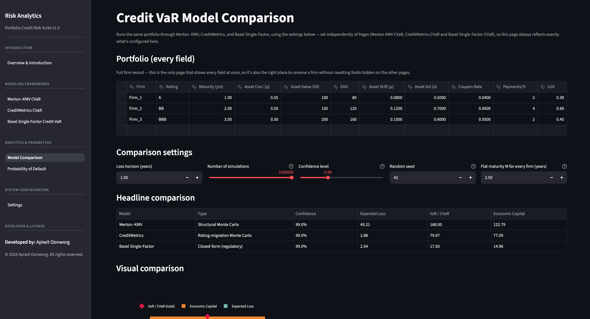
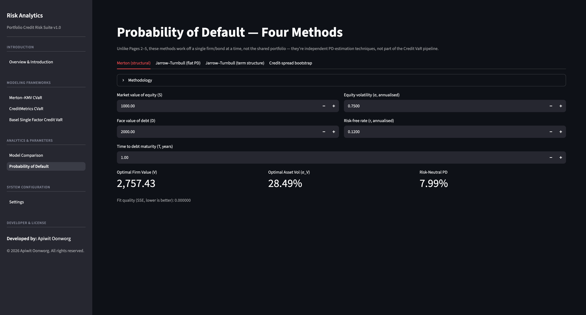

# 🔍 Credit Risk Dashboard

**One portfolio. Three credit-risk methodologies. Wildly different capital numbers — see exactly why.**

[](https://credit-risk-models-by-apiwit1604.streamlit.app/)


[](LICENSE)

> ⚠️ Verify the Python version badge against your `requirements.txt` before you rely on it — swap `3.10+` for whatever you've actually pinned.

An interactive Streamlit dashboard comparing three portfolio **Credit
Value-at-Risk (Credit VaR)** frameworks and four **Probability of Default
(PD)** estimation methods, built from a research notebook that has been
restructured into a proper, importable Python package.

Edit a loan/bond portfolio once, and watch it get priced under a **structural
Monte Carlo model**, a **rating-migration Monte Carlo model**, and the
**Basel regulatory formula** — side by side, with every "hard to calibrate"
market input (transition matrix, curves) exposed on a settings page instead
of hardcoded.

### What this project demonstrates
- Quantitative credit risk modeling: Merton–KMV, CreditMetrics, Basel ASRF
- One-factor Gaussian copula Monte Carlo simulation
- Regulatory capital modeling (Basel II/III IRB formulas)
- PD estimation via both structural (option-theoretic) and reduced-form / hazard-rate methods
- Software engineering discipline: a framework-agnostic modeling core (`src/`) with zero Streamlit dependency, cleanly separated from the UI layer — not just a notebook pasted into an app

**🚀 [Launch the live dashboard →](https://credit-risk-models-by-apiwit1604.streamlit.app/)**

[](https://credit-risk-models-by-apiwit1604.streamlit.app/)

---

## Table of contents

- [Explore the dashboard](#-explore-the-dashboard)
- [Screens](#screens)
- [Quick start](#quick-start)
- [Project structure](#project-structure)
- [Methodology](#methodology)
  - [Credit VaR: three ways to measure portfolio risk](#credit-var-three-ways-to-measure-portfolio-risk)
  - [Probability of Default: four independent methods](#probability-of-default-four-independent-methods)
- [Known limitations & design decisions](#known-limitations--design-decisions)
- [Tech stack](#tech-stack)
- [About](#about)
- [License](#license)

## 📊 Explore the dashboard

| # | Page | What you'll see | Launch |
| :-: | :--- | :--- | :---: |
| 01 | **Introduction** | System overview, framework connections & project architecture | [](https://credit-risk-models-by-apiwit1604.streamlit.app/) |
| 02 | **Merton–KMV Credit VaR** | Asset value paths via 1-factor Gaussian copula | [](https://credit-risk-models-by-apiwit1604.streamlit.app/Merton_KMV_CVaR) |
| 03 | **CreditMetrics Credit VaR** | Credit rating migrations & yield/spread revaluation | [](https://credit-risk-models-by-apiwit1604.streamlit.app/CreditMetrics_CVaR) |
| 04 | **Basel ASRF Credit VaR** | Regulatory capital via closed-form Basel II/III ASRF | [](https://credit-risk-models-by-apiwit1604.streamlit.app/Basel_Single_Factor_CVaR) |
| 05 | **Model Comparison** | Risk metric divergence across concentrated portfolios | [](https://credit-risk-models-by-apiwit1604.streamlit.app/Model_Comparison) |
| 06 | **PD Suite** | Standalone PD estimation across 4 institutional methods | [](https://credit-risk-models-by-apiwit1604.streamlit.app/Probability_of_Default) |
| 07 | **Settings** | Centralized rating scales, transition matrices & yield curves | [](https://credit-risk-models-by-apiwit1604.streamlit.app/Settings) |

### Screens

| | |
| :---: | :---: |
| **[Introduction](https://credit-risk-models-by-apiwit1604.streamlit.app/)**<br>[](https://credit-risk-models-by-apiwit1604.streamlit.app/) | **[Merton–KMV Credit VaR](https://credit-risk-models-by-apiwit1604.streamlit.app/Merton_KMV_CVaR)**<br>[](https://credit-risk-models-by-apiwit1604.streamlit.app/Merton_KMV_CVaR) |
| **[CreditMetrics Credit VaR](https://credit-risk-models-by-apiwit1604.streamlit.app/CreditMetrics_CVaR)**<br>[](https://credit-risk-models-by-apiwit1604.streamlit.app/CreditMetrics_CVaR) | **[Basel ASRF Credit VaR](https://credit-risk-models-by-apiwit1604.streamlit.app/Basel_Single_Factor_CVaR)**<br>[](https://credit-risk-models-by-apiwit1604.streamlit.app/Basel_Single_Factor_CVaR) |
| **[Model Comparison](https://credit-risk-models-by-apiwit1604.streamlit.app/Model_Comparison)**<br>[](https://credit-risk-models-by-apiwit1604.streamlit.app/Model_Comparison) | **[PD Suite](https://credit-risk-models-by-apiwit1604.streamlit.app/Probability_of_Default)**<br>[](https://credit-risk-models-by-apiwit1604.streamlit.app/Probability_of_Default) |

## Quick start

```bash
git clone <this-repo>
cd credit-risk-dashboard
pip install -r requirements.txt
streamlit run app.py
```

The app opens with an Introduction page; use the sidebar to move between
pages. The portfolio table on Pages 2–5 is shared state — edit it on any
one of those pages and the others pick it up immediately.

## Project structure

```
credit-risk-dashboard/
├── app.py                               # Page 1 — Introduction (Streamlit entry point)
├── pages/
│   ├── 2_Merton_KMV_CVaR.py             # Page 2 — structural Monte Carlo CVaR
│   ├── 3_CreditMetrics_CVaR.py          # Page 3 — rating-migration Monte Carlo CVaR
│   ├── 4_Basel_Single_Factor_CVaR.py    # Page 4 — closed-form regulatory CVaR
│   ├── 5_Model_Comparison.py            # Page 5 — all three CVaR models side by side
│   ├── 6_Probability_of_Default.py      # Page 6 — four PD methods
│   └── 7_Settings.py                    # Page 7 — rating scale / transition matrix / curves
├── src/                                 # Framework-agnostic modeling library (no Streamlit imports)
│   ├── config.py                        # Default market data & demo portfolio
│   ├── curves.py                        # Transition-matrix power, spot curves, forward rates
│   ├── rating_scale.py                  # Reshape the transition matrix / spread curve to a new rating scale
│   ├── valuation.py                     # Forward-value revaluation (used by CreditMetrics)
│   ├── credit_var/
│   │   ├── merton_kmv.py                # Model 1 — structural Monte Carlo
│   │   ├── credit_metrics.py            # Model 2 — rating-migration Monte Carlo
│   │   └── basel_single_factor.py       # Model 3 — Basel ASRF closed-form
│   ├── default_probability/
│   │   ├── merton_structural.py         # PD method 1 — option-theoretic
│   │   ├── jarrow_turnbull.py           # PD methods 2 & 3 — reduced-form hazard rate
│   │   └── credit_spread_bootstrap.py   # PD method 4 — model-free bootstrap
│   ├── state.py                         # Streamlit session-state defaults (dashboard-only)
│   ├── compute.py                       # st.cache_data wrappers around the pure model functions
│   ├── ui_components.py                 # Per-model portfolio editors (column-restricted) + full editor
│   └── ui.py                            # UI Architecture & Component Reusability
├── images/                              # UI screenshots for documentation
├── requirements.txt
├── LICENSE
└── .gitignore
```

Everything under `src/` other than `state.py`, `compute.py` and
`ui_components.py` is plain NumPy/pandas/SciPy — it can be imported and
used (or unit-tested) with no Streamlit dependency at all.

## Methodology

### Credit VaR: three ways to measure portfolio risk

All three price the **same** demo portfolio (or your edited one): three
exposures with a rating, maturity, coupon schedule, EAD and LGD.

#### 1. Merton–KMV (structural, asset-value Monte Carlo)

Each firm's asset return is driven by a common systematic factor plus its
own idiosyncratic shock. A firm defaults in a given simulation draw if its
simulated asset value falls below its exposure (a simplified default
barrier), and portfolio-level VaR is read off the resulting loss
distribution.

<details>
<summary>Show the math</summary>

A one-factor Gaussian copula where `asset_correlation` $\rho_i$ is firm
$i$'s loading on the common factor $M$:

$$
Z_i = \sqrt{\rho_i}\,M + \sqrt{1-\rho_i}\,\varepsilon_i, \qquad M,\varepsilon_i \overset{\text{iid}}{\sim} \mathcal{N}(0,1)
$$

$$
V_{i,T} = V_{i,0}\exp\!\big(T(\mu_i + \sigma_i Z_i)\big)
$$

A firm **defaults** in a given draw if $V_{i,T} < \text{EAD}_i$, with
$\text{Loss}_i = \text{EAD}_i \times \text{LGD}_i$. Portfolio loss sums
across firms over `n_sims` draws; **VaR** is the empirical quantile at the
chosen confidence level, **Expected Shortfall** is the mean loss beyond
VaR, and **Economic Capital** is VaR net of the expected loss already
priced in.

</details>

#### 2. CreditMetrics (rating-migration Monte Carlo)

Rather than a binary default/no-default outcome, every firm is revalued
under **every possible ending rating**, and loss is the mark-to-market
swing between the firm's current rating and its simulated one. This is
the only one of the three models sensitive to the credit-spread curve.

<details>
<summary>Show the math</summary>

1. The 1-year transition matrix $P$ is raised to a fractional power to
   match the loss horizon $h$: $P_h = P^{h}$ (via
   `scipy.linalg.fractional_matrix_power`).
2. Cumulative migration probabilities become threshold $z$-scores via the
   inverse normal CDF, and each firm's ending rating in a given draw is
   read off the same single-factor Gaussian copula used in Merton–KMV.
3. Every exposure is revalued under every rating by discounting its
   remaining cash flows on that rating's forward curve, built from the
   risk-free curve plus that rating's credit spread:

$$
V(\text{rating}) = \sum_t \frac{CF_t}{\big(1+f_t(\text{rating})\big)^{t-h}}
$$

Loss in a draw = value under the firm's **current** rating − value under
its **simulated** rating.

</details>

#### 3. Basel Single-Factor (ASRF, closed-form)

The Basel II/III corporate IRB formula — a direct calculation, no
simulation required. $M$ is the effective maturity (capped/floored at
1–5 years), defaulting to each firm's own `years_to_maturity` rather than
a single flat assumption, as the original notebook did.

<details>
<summary>Show the math</summary>

$$
R(PD) = 0.12\cdot\frac{1-e^{-50PD}}{1-e^{-50}} + 0.24\cdot\left(1-\frac{1-e^{-50PD}}{1-e^{-50}}\right)
$$

$$
b(PD) = \big(0.11852-0.05478\ln PD\big)^2, \qquad
MA(PD,M) = \frac{1+(M-2.5)\,b(PD)}{1-1.5\,b(PD)}
$$

$$
WCDR(PD) = \Phi\!\left(\frac{\Phi^{-1}(PD)+\sqrt{R}\,\Phi^{-1}(0.999)}{\sqrt{1-R}}\right)
$$

$$
K = \big(LGD\cdot WCDR(PD)-PD\cdot LGD\big)\cdot MA(PD,M), \quad
EC = K\times EAD, \quad EL = PD\times LGD\times EAD
$$

</details>

**[Page 5 — Model Comparison](https://credit-risk-models-by-apiwit1604.streamlit.app/Model_Comparison)** lines these three up side by side and shows why a small, concentrated demo portfolio is exactly the setting where structural, migration-based and regulatory-formula answers diverge most.

### Probability of Default: four independent methods

Page 6 covers four independent ways to get a PD for a single firm/bond —
these are not part of the portfolio Credit VaR pipeline above.

1. **Merton structural model** — equity as a call option on firm assets;
   solve jointly for asset value and asset volatility, read off a
   **risk-neutral** PD from the resulting distance-to-default. (Risk-neutral,
   because it uses the risk-free rate as drift — not the same thing as a
   real-world/physical PD, which needs the firm's actual expected asset
   return, e.g. Moody's KMV EDF mapping.)
2. **Jarrow–Turnbull (1995), flat PD** — a single, constant hazard rate
   calibrated so the model's defaultable-bond price matches an observed
   market price, discounting on the risk-free curve.
3. **Jarrow–Turnbull (1995), term structure** — the same idea with one
   hazard rate per coupon period instead of a single constant.
4. **Credit-spread bootstrap** — a model-free method: compare each
   period's risky zero-coupon price to the risk-free price to back out
   cumulative survival probability directly from the spread, then
   difference across periods for unconditional/conditional PDs.

## Known limitations & design decisions

Documented, deliberately **not** changed:

- **Merton structural solve** (`default_probability/merton_structural.py`)
  uses a single penalized least-squares objective (Nelder–Mead) to jointly
  solve the two Merton equations, rather than the more standard exact
  2-equation solve (e.g. `scipy.optimize.fsolve`). The heuristic works, but
  depends on the `weight_sigma` penalty and the optimizer's convergence.

## Tech stack

`Python` · `Streamlit` · `NumPy` · `pandas` · `SciPy`

## About

**Apiwit Oonworg**
BBA, Finance (Minor: Management Information Systems) — Thammasat University

📫 LinkedIn: _add your link_ · GitHub: _add your link_ · Email: _add your address_

## License

MIT — see [LICENSE](LICENSE).
