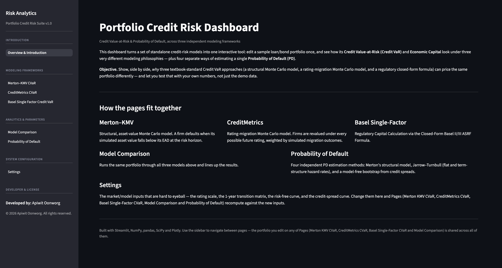

# Portfolio Credit Risk Dashboard

An interactive Streamlit dashboard comparing three portfolio **Credit
Value-at-Risk (Credit VaR)** frameworks and four **Probability of Default
(PD)** estimation methods, built from a research notebook that has been
restructured into a proper, importable Python package.

**Live structure:** edit a loan/bond portfolio once, and see how it prices
under a structural Monte Carlo model, a rating-migration Monte Carlo model,
and the Basel regulatory formula — side by side, with the "hard to
calibrate" market inputs (transition matrix, curves) exposed on a settings
page so nothing is hardcoded.

## Visual Overview

Click on any dashboard preview below to jump directly to its detailed model specification section:

<p align="center">
  <a href="https://credit-risk-models-by-apiwit1604.streamlit.app/">
    
  </a>
  <br>
  <sub>Click image to navigate to the dashboard.</sub>
</p>

---

## Table of contents

- [Quick start](#quick-start)
- [Project structure](#project-structure)
- [The three Credit VaR models](#the-three-credit-var-models)
- [The four PD estimation methods](#the-four-pd-estimation-methods)
- [What was fixed vs. the original notebook](#what-was-fixed-vs-the-original-notebook)
- [Known limitations](#known-limitations)
- [License](#license)

## Quick start

```bash
git clone <this-repo>
cd credit-risk-dashboard
pip install -r requirements.txt
streamlit run app.py
```

The app opens with an Introduction page; use the sidebar to move between
pages. The portfolio table on Pages 2–5 is shared state — edit it on any
one of those pages and the others pick it up immediately.

## Project structure

```
credit-risk-dashboard/
├── app.py                               # Page 1 — Introduction (Streamlit entry point)
├── pages/
│   ├── 2_Merton_KMV_CVaR.py             # Page 2 — structural Monte Carlo CVaR
│   ├── 3_CreditMetrics_CVaR.py          # Page 3 — rating-migration Monte Carlo CVaR
│   ├── 4_Basel_Single_Factor_CVaR.py    # Page 4 — closed-form regulatory CVaR
│   ├── 5_Model_Comparison.py            # Page 5 — all three CVaR models side by side
│   ├── 6_Probability_of_Default.py      # Page 6 — four PD methods
│   └── 7_Settings.py                    # Page 7 — rating scale / transition matrix / curves
├── src/                                 # Framework-agnostic modeling library (no Streamlit imports)
│   ├── config.py                        # Default market data & demo portfolio
│   ├── curves.py                        # Transition-matrix power, spot curves, forward rates
│   ├── rating_scale.py                  # Reshape the transition matrix / spread curve to a new rating scale
│   ├── valuation.py                     # Forward-value revaluation (used by CreditMetrics)
│   ├── credit_var/
│   │   ├── merton_kmv.py                # Model 1 — structural Monte Carlo
│   │   ├── credit_metrics.py            # Model 2 — rating-migration Monte Carlo
│   │   └── basel_single_factor.py       # Model 3 — Basel ASRF closed-form
│   ├── default_probability/
│   │   ├── merton_structural.py         # PD method 1 — option-theoretic
│   │   ├── jarrow_turnbull.py           # PD methods 2 & 3 — reduced-form hazard rate
│   │   └── credit_spread_bootstrap.py   # PD method 4 — model-free bootstrap
│   ├── state.py                         # Streamlit session-state defaults (dashboard-only)
│   ├── compute.py                       # st.cache_data wrappers around the pure model functions
│   ├── ui_components.py                 # Per-model portfolio editors (column-restricted) + full editor
│   └── ui.py                            # UI Architecture & Component Reusability
├── docs/
│   └── images/                          # UI screenshots for documentation                 
├── requirements.txt
├── LICENSE
└── .gitignore
```

Everything under `src/` other than `state.py`, `compute.py` and
`ui_components.py` is plain NumPy/pandas/SciPy — it can be imported and
used (or unit-tested) with no Streamlit dependency at all.

## The three Credit VaR models

All three price the **same** demo portfolio (or your edited one): three
exposures with a rating, maturity, coupon schedule, EAD and LGD.

### 1. Merton–KMV (structural, asset-value Monte Carlo)

Each firm's log-asset-return is driven by a common systematic factor $M$
plus an idiosyncratic shock $\varepsilon_i$ — a one-factor Gaussian copula
where `asset_correlation` $\rho_i$ is firm $i$'s loading on the common
factor:

$$
Z_i = \sqrt{\rho_i}\,M + \sqrt{1-\rho_i}\,\varepsilon_i, \qquad M,\varepsilon_i \overset{\text{iid}}{\sim} \mathcal{N}(0,1)
$$

$$
V_{i,T} = V_{i,0}\exp\!\big(T(\mu_i + \sigma_i Z_i)\big)
$$

A firm **defaults** in a given draw if $V_{i,T} < \text{EAD}_i$ (a
simplified default barrier in place of a full debt schedule), with
$\text{Loss}_i = \text{EAD}_i \times \text{LGD}_i$. Portfolio loss sums
across firms over `n_sims` draws; **VaR** is the empirical quantile at the
chosen confidence level, **Expected Shortfall** is the mean loss beyond
VaR, and **Economic Capital** is VaR net of the expected loss already
priced in.

### 2. CreditMetrics (rating-migration Monte Carlo)

Rather than a binary default/no-default outcome, every firm is revalued
under **every possible ending rating**:

1. The 1-year transition matrix $P$ is raised to a fractional power to
   match the loss horizon $h$: $P_h = P^{h}$ (via
   `scipy.linalg.fractional_matrix_power`).
2. Cumulative migration probabilities become threshold $z$-scores via the
   inverse normal CDF, and each firm's ending rating in a given draw is
   read off the same single-factor Gaussian copula used in Merton–KMV.
3. Every exposure is revalued under every rating by discounting its
   remaining cash flows on that rating's forward curve, built from the
   risk-free curve plus that rating's credit spread:

$$
V(\text{rating}) = \sum_t \frac{CF_t}{\big(1+f_t(\text{rating})\big)^{t-h}}
$$

Loss in a draw = value under the firm's **current** rating − value under
its **simulated** rating. This is the only one of the three models
sensitive to the credit-spread curve.

### 3. Basel Single-Factor (ASRF, closed-form)

The Basel II/III corporate IRB formula — no simulation.

$$
R(PD) = 0.12\cdot\frac{1-e^{-50PD}}{1-e^{-50}} + 0.24\cdot\left(1-\frac{1-e^{-50PD}}{1-e^{-50}}\right)
$$

$$
b(PD) = \big(0.11852-0.05478\ln PD\big)^2, \qquad
MA(PD,M) = \frac{1+(M-2.5)\,b(PD)}{1-1.5\,b(PD)}
$$

$$
WCDR(PD) = \Phi\!\left(\frac{\Phi^{-1}(PD)+\sqrt{R}\,\Phi^{-1}(0.999)}{\sqrt{1-R}}\right)
$$

$$
K = \big(LGD\cdot WCDR(PD)-PD\cdot LGD\big)\cdot MA(PD,M), \quad
EC = K\times EAD, \quad EL = PD\times LGD\times EAD
$$

$M$ is the effective maturity — capped/floored at 1–5 years — and (unlike
the original notebook — see below) defaults to each firm's own
`years_to_maturity` rather than a single flat assumption.

Page 5 lines these three up side by side and shows why a small,
concentrated demo portfolio is exactly the setting where structural,
migration-based and regulatory-formula answers diverge most.

## The four PD estimation methods

Page 6 covers four independent ways to get a PD for a single firm/bond —
these are not part of the portfolio Credit VaR pipeline above.

1. **Merton structural model** — equity as a call option on firm assets;
   solve jointly for asset value and asset volatility, read off a
   **risk-neutral** PD from the resulting distance-to-default. (Risk-neutral,
   because it uses the risk-free rate as drift — not the same thing as a
   real-world/physical PD, which needs the firm's actual expected asset
   return, e.g. Moody's KMV EDF mapping.)
2. **Jarrow–Turnbull (1995), flat PD** — a single, constant hazard rate
   calibrated so the model's defaultable-bond price matches an observed
   market price, discounting on the risk-free curve.
3. **Jarrow–Turnbull (1995), term structure** — the same idea with one
   hazard rate per coupon period instead of a single constant.
4. **Credit-spread bootstrap** — a model-free method: compare each
   period's risky zero-coupon price to the risk-free price to back out
   cumulative survival probability directly from the spread, then
   difference across periods for unconditional/conditional PDs.

## Known limitations

Documented, deliberately **not** changed:

- **Merton structural solve** (`default_probability/merton_structural.py`)
  uses a single penalized least-squares objective (Nelder–Mead) to jointly
  solve the two Merton equations, rather than the more standard exact
  2-equation solve (e.g. `scipy.optimize.fsolve`). The heuristic works, but
  depends on the `weight_sigma` penalty and the optimizer's convergence.
- **Portfolio-level correlation** in Merton–KMV and CreditMetrics is a
  single-factor model — every firm loads on the same one systematic
  factor. A multi-factor or empirical correlation matrix would capture
  sector/geography structure that a single factor cannot.
- **Rating scale changes on the Settings page** (adding/removing a rating
  category, not just renaming one) require manually resizing the
  transition matrix to match — the app validates this but doesn't
  automate reshaping the matrix itself.

## License

MIT — see [LICENSE](LICENSE).
